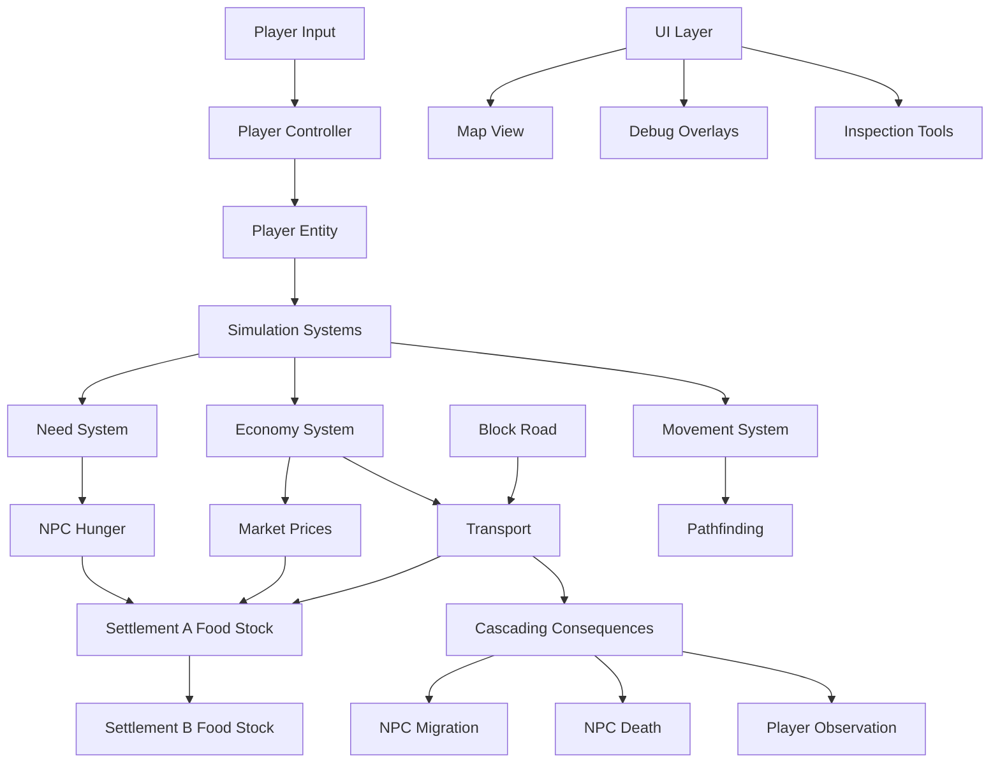

# Alpha Release Plan - Reaching Universalis

## Overview
The first alpha release aims to validate the core simulation loop: an "indifferent world" where NPCs live through institutions, logistics matter, and disruptions cascade. This is the "logistic toy" described in the design blueprint.

**Goal**: Demonstrate that the simulation can produce emergent consequences from simple systems without scripted events.

**Target Platform**: Windows (Unreal Engine 5)
**Team**: Solo developer
**Timeline**: Flexible, but aiming for a playable slice within 3-4 months of focused development.

## Alpha Scope
The alpha will be a **minimal playable slice** focusing on a single region with two settlements and ~50 NPCs.

### Core Systems Required
1. **World Map & Settlements**
   - Continuous 2D map (similar to Aurora 4X) representing a small region
   - Two settlements: Settlement A (food producer), Settlement B (consumer)
   - A road connecting them
   - Basic terrain (plains, forest, river)

2. **NPC Agent Simulation**
   - NPCs have basic needs: hunger, sleep, safety
   - Daily schedule (habit layer): sleep at night, work during day
   - Movement between locations (home, workplace, market)
   - Simple pathfinding on roads

3. **Economy & Logistics**
   - Food production in Settlement A (farm plots)
   - Food consumption in both settlements
   - NPCs automatically transport food via merchants or household members
   - Goods have weight/volume (simplified)
   - Local market prices emerge from supply/demand

4. **Time System**
   - Variable tick rate (seconds to hours)
   - Day/night cycle affecting NPC schedules

5. **UI & Visualization**
   - Top-down map view (Google Earth style)
   - Simple icons for NPCs, settlements, goods
   - Inspection tools to see NPC state, market prices, supply chains

### Non-Scope (Excluded for Alpha)
- Combat, injury, health
- Crafting, construction
- Complex relationships, families
- Weather, seasons
- Off-map world
- Multiplayer
- Advanced graphics

## Technical Architecture

### Unreal Engine Adaptation
The simulation will be built using Unreal Engine's **Entity Component System (ECS)** via the **MassEntity** plugin (or a custom C++ ECS). This is critical for performance with thousands of entities.

**Data-Driven Design**:
- NPC definitions in JSON/DataTable
- Item definitions (food types, materials)
- Recipe definitions (production chains)

**Simulation Layers**:
1. **Core Simulation** (C++): Tick-based systems for needs, economy, movement
2. **Visualization** (Blueprints): Map rendering, UI, camera controls
3. **Player Input** (Blueprints): Control of player character

**Persistence**: SQLite for save games (or binary serialization).

### Performance Considerations
- Limit NPC count to ~50 for alpha
- Use LOD simulation: only simulate NPCs in active region
- Batch processing of needs/economy

## Prioritized Feature Roadmap

### Phase Alpha-0: Foundation (Month 1)
- [ ] Set up Unreal project with MassEntity plugin
- [ ] Create continuous 2D map system (Aurora-style)
- [ ] Implement basic NPC entity with position, needs components
- [ ] Implement simple pathfinding (road network)
- [ ] Create two settlement actors with inventory storage

### Phase Alpha-1: Economy Loop (Month 2)
- [ ] Food production system (farm plots produce over time)
- [ ] NPC hunger need (decreases over time, requires food)
- [ ] Market system: settlements have food stocks, prices adjust
- [ ] Merchant NPCs: transport food between settlements
- [ ] Basic UI: map view, settlement info, NPC info

### Phase Alpha-2: Disruption & Consequences (Month III)
- [ ] External disruption system (block road via debug command)
- [ ] Cascading consequences: when road blocked, Settlement B starves
- [ ] NPC reactions: migration, death, theft
- [ ] Save/load system

### Phase Alpha-3: Polish & Testing (Month IV)
- [ ] Debug visualization (needs bars, supply lines)
- [ ] Balance tuning (production rates, consumption rates)
- [ ] Bug fixing, performance optimization
- [ ] Create alpha build for internal testing

## Success Criteria
The alpha is successful if:
1. The simulation runs without crashing for at least 1 hour of gameplay.
2. NPCs autonomously transport food from Settlement A to B.
3. Blocking the road (via debug command) causes Settlement B's food stock to drop, NPC hunger to rise, and observable consequences (NPCs migrating, dying, or stealing).
4. The simulation runs autonomously without player intervention, demonstrating emergent behavior.

## Risk Mitigation
- **Scope creep**: Strictly limit to two settlements and food logistics.
- **Performance**: Use ECS from the start; profile early.
- **Complexity**: Start with simplified needs (only hunger) and expand later.
- **UI**: Use minimal debug UI; prioritize simulation over polish.

## Deliverables
1. **Playable Windows build** (.exe) with a single scenario.
2. **Source code** (Git repository) with documented systems.
3. **Design document** explaining the simulation rules.
4. **Bug list** and feedback collection.

## Next Steps After Alpha
If the core loop is validated, proceed to Phase 1 (Foundation) as described in the design blueprint:
- Add more needs (sleep, safety)
- Add households, jobs
- Add basic combat
- Expand to 5 settlements

## Mermaid Diagram: Alpha Architecture

## Conclusion
The alpha release is a critical proof-of-concept that will determine if the simulation-first approach is feasible and engaging. By focusing on the smallest possible slice—two settlements and food logistics—we can validate the core technology and design before committing to years of development.

**Ready for implementation?** Review this plan and provide feedback.