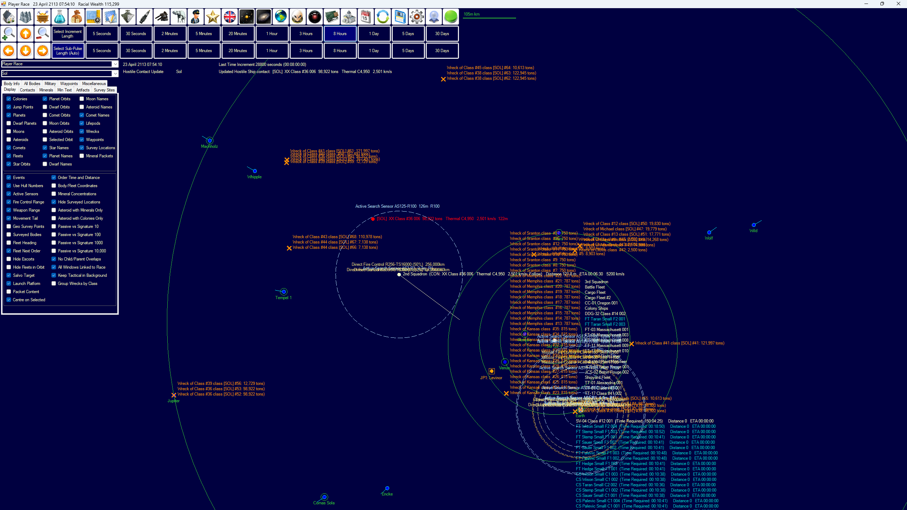

### Basic Questions

Who?
AI Centric World
Player is not the main character
Player/AI reacts to the World/Other Influences

Where
Medieval Europe

What?
What's the point?
World Simulation/Immersive Sim
You're not the main character but you could make enough waves that the world would revolve around you.

**Main playing screen**
1. Should be a Google earth eagle eye POV like interface
simular to Auroa

But at the planet level instead of solar system level

### NPCs
i dont need/want graphics i want a more detailed simulation so for now we can just use a simple circle dot or arrow to mark the NPC/Player

**Ai Levels**
The order of importance

A NPC will take care of themselves first, their family second, their village next and so on
1. Person
2. Family
3. Village
4. County
5. Dutchy
6. Kingdom
7. Empire

**AI Levels Wants**
1. Person
    1. Personal Needs
        1. Food
        2. Water
        3. Shelter
        4. Heat
        5. Protection
    2. Personal Wants
        1. Money
        2. Luxuries
        3. Etc
2. Family
    1. Family’s Needs
        1. Food
        2. Water
        3. Heat
        4. Shelter
        5. Protection
    2. Wants
        1. Money
        2. Luxuries
        3. Etc
3. Village
    1. Town Needs
        1. Food
        2. Water
        3. Protection
4. County
    1. Protection
5. Dutchy
    1. Protection
6. Kingdom
    1. Protection
7. Empire
    1. Protection

### Networking/Computing

**Cluster Network**

Due to the amount of compute needed to have such a detailed simulation it may be a good idea to be able to distribe the comuptation to other devices.

It needs to be cluster based, each computer should compute what is within its Local zone and pass it on to the rest of the peers in the cluster

This would be very Network heavy so local clusters would be the best

but if multiplayer is to be implemeted then there would have to be some sort of verifcation

one idea is to have the data be computed on a separte node (should try and corroalate nodes to idetify nodes on the same network to prevent 2 node verifying each other if owned by the same person) 

If the data returned by the verifying node is different to the one by the checked node then you know they are running a modified game engine or hacking

could use a checksome to quick check the output

**Client classifications**

Verified - Owner run / unbiased clients

Trusted - players that have had little deviations from verified/trusted clients

Untrusted - New clients / clients with deviations

Deviant - hostile clients who have large deviations or hacking

Client modifiers

Marked - clients that have been marked by admin for extra verification

New - new clients , dont use for single verification, Untrusted only due to not having a history

Linked accounts - clients that joined around the same time or have simular networking latency or IP, so don’t verify using eachother as they both could be run by the same person.

