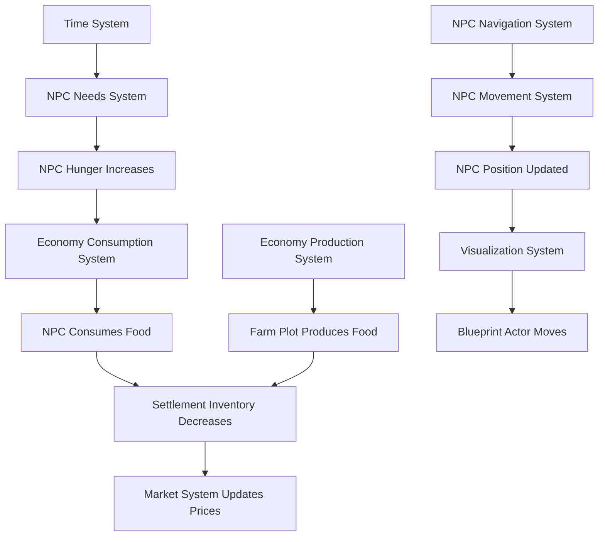

# Reaching Universalis - Phase Alpha-0 Architecture Design

## Overview
This document outlines the technical architecture for Phase Alpha-0 (Foundation) of the Reaching Universalis simulation game. The goal is to establish the core ECS framework, data structures, and module organization required for the minimal playable slice described in Alpha1.md.

## 1. ECS Architecture with MassEntity

### 1.1 Entity Archetypes
We define the following entity archetypes using MassEntity's `FMassArchetype`:

1. **NPC** - Represents a non-player character with needs, inventory, and movement.
2. **Settlement** - Represents a settlement with inventory storage, production facilities, and population.
3. **Item** - Represents a physical good (food, materials) that can be stored, transported, and consumed.
4. **Road** - Represents a road segment connecting two points on the map.
5. **FarmPlot** - Represents a food production facility attached to a settlement.
6. **Player** - Represents the player's observer entity (optional for Alpha-0).

### 1.2 Component Schemas

#### Core Components (Shared)
- **FTransformComponent**: Position, rotation, scale (UE built-in)
- **FMassTagComponent**: Tag for filtering (e.g., `Tag_NPC`, `Tag_Settlement`)
- **FMassVelocityComponent**: Velocity for movement
- **FMassEntityHandleComponent**: Reference to other entities

#### NPC Components
- **FNPCNeedsComponent**: Struct containing hunger, sleep, safety values (0-100)
- **FNPCInventoryComponent**: Array of item entity handles with quantities
- **FNPCStateComponent**: Current state (idle, moving, working, sleeping)
- **FNPCIdentityComponent**: Name, age, gender, skills
- **FNPCJobComponent**: Current job (farmer, merchant, etc.) and workplace entity handle
- **FNPCNavigationComponent**: Pathfinding data (current path, target position)

#### Settlement Components
- **FSettlementInventoryComponent**: Storage capacity and item stockpiles
- **FSettlementPopulationComponent**: List of NPC entity handles residing in settlement
- **FSettlementProductionComponent**: List of farm plot entity handles
- **FSettlementMarketComponent**: Current market prices for items

#### Item Components
- **FItemDefinitionComponent**: Reference to DataTable row defining item properties (type, weight, volume, nutritional value)
- **FItemLocationComponent**: Current container entity (Settlement or NPC) and position

#### Road Components
- **FRoadSegmentComponent**: Start and end positions, length, terrain type
- **FRoadNetworkComponent**: Graph connectivity (adjacent road entities)

#### FarmPlot Components
- **FFarmPlotProductionComponent**: Production rate (food per day), current growth progress
- **FFarmPlotOwnershipComponent**: Owning settlement entity handle

### 1.3 Processor Systems
MassEntity processors (`UMassProcessor` subclasses) execute logic on entities matching specific component requirements.

1. **UNPCNeedsSystem**: Updates hunger, sleep, safety values over time.
2. **UNPCMovementSystem**: Moves NPCs along paths using velocity.
3. **UNPCNavigationSystem**: Calculates paths using road network.
4. **UEconomyProductionSystem**: Updates farm plot production and adds items to settlement inventory.
5. **UEconomyConsumptionSystem**: NPCs consume food from inventory based on hunger.
6. **UEconomyMarketSystem**: Adjusts settlement market prices based on supply/demand.
7. **UTimeSystem**: Advances simulation time, triggers day/night cycle.
8. **UVisualizationSystem**: Updates Blueprint actor positions for visualization.

### 1.4 Component Dependencies and Data Flow

## 2. Data Structure Design

### 2.1 Continuous 2D Map System
- **FWorldMap**: 2D grid of tiles (1000x1000) with floating-point coordinates.
- **FTileData**: Terrain type (plains, forest, river), elevation, resource density.
- **Map Representation**: Use `UProceduralMeshComponent` for terrain visualization or simple top-down sprite.
- **Coordinate System**: World units in meters, with origin at map center.

### 2.2 Road Network Representation
- **Graph Structure**: Adjacency list of road segments.
- **FRoadGraphNode**: Position, connected segment IDs.
- **FRoadGraphEdge**: Segment ID, length, traversal cost.
- **Pathfinding**: Use A* algorithm on road graph with heuristic based on Euclidean distance.
- **Spatial Partitioning**: Quadtree for quick lookup of nearest road segments to a position.

### 2.3 Settlement Inventory Management
- **FInventorySlot**: Item type ID, quantity, quality.
- **FInventory**: Array of slots with total weight/volume capacity.
- **Transaction System**: Add/remove items with validation.

### 2.4 NPC Schedule/Habit System
- **FScheduleEntry**: Time range (0-24h), activity type (sleep, work, leisure), location entity.
- **FSchedule**: Array of schedule entries for each day of week.
- **Habit Layer**: NPCs follow schedule unless interrupted by needs (hunger overrides).

## 3. Class Hierarchy & Module Structure

### 3.1 C++ Module Organization
Create the following Unreal Engine modules (in Source/ directory):

1. **SimulationCore**: Core ECS framework, component definitions, processor base classes.
2. **MapSystem**: World map, tile data, road network, pathfinding.
3. **Economy**: Production, consumption, market systems.
4. **NPCSystem**: NPC needs, movement, navigation, schedule.
5. **DataDefinitions**: DataTable structures, JSON import/export.
6. **Visualization**: Blueprint integration, actor spawning, debug drawing.

### 3.2 Blueprint Class Hierarchy
- **BP_WorldMapActor**: Actor that visualizes the 2D map.
- **BP_SettlementActor**: Visual representation of settlement (icon/building).
- **BP_NPCActor**: Simple sprite or mesh for NPC visualization.
- **BP_RoadActor**: Line or mesh for road visualization.
- **BP_PlayerController**: Handles input for map navigation and debug commands.

### 3.3 DataTable/JSON Schemas
- **NPCDefinitions.csv**: Columns: NPC_ID, Name, Age, Gender, Skill_Farming, Skill_Merchant, etc.
- **ItemDefinitions.csv**: Columns: Item_ID, Name, Weight, Volume, Nutrition, Type.
- **RecipeDefinitions.csv**: Columns: Recipe_ID, InputItems, OutputItems, TimeRequired.
- **SettlementDefinitions.csv**: Columns: Settlement_ID, Name, PositionX, PositionY, InventoryCapacity.

### 3.4 Interface Between C++ and Blueprint
- **Data Accessors**: Blueprint callable functions in `USimulationSubsystem` to query entity data.
- **Event Dispatchers**: C++ events dispatched to Blueprint for visualization updates.
- **Debug Commands**: Console commands implemented in C++ for testing (e.g., "BlockRoad").

## 4. Technical Specifications

### 4.1 Performance Considerations for ~50 NPCs
- **Batch Processing**: Use MassEntity's parallel processing capabilities.
- **LOD Simulation**: Only simulate NPCs within active region (future enhancement).
- **Component Storage**: Use `FMassFragment` for data, `FMassTag` for flags.
- **Memory Layout**: Optimize for cache locality by grouping frequently accessed components.

### 4.2 Batch Processing Strategies
- **Need Updates**: Process all NPCs every 10 seconds (not every frame).
- **Movement Updates**: Process every frame for moving NPCs only.
- **Economy Updates**: Process every minute (simulated time).

### 4.3 Spatial Partitioning for Pathfinding
- **Quadtree**: Partition road segments for quick nearest-neighbor queries.
- **Precomputed Paths**: Cache common paths (settlement-to-settlement) for reuse.

### 4.4 Serialization Approach for Save/Load
- **Save Format**: JSON for human readability, binary for performance.
- **Serialized Data**: Entity IDs, component values, map state, time.
- **System**: Use `USaveGame` subsystem with custom serialization functions.

### 4.5 Debug Visualization Architecture
- **Debug Drawing**: Use `DrawDebug` functions for needs bars, path lines, inventory counts.
- **Overlay UI**: Simple HUD showing simulation stats.
- **Console Commands**: Implement via `UCheatManager` extension.

## 5. Implementation Roadmap for Phase Alpha-0

### Step-by-Step Implementation Sequence
1. **Setup MassEntity Plugin**: Ensure plugin is enabled and configured.
2. **Create SimulationCore Module**: Define base components and processors.
3. **Implement World Map System**: Create continuous 2D map with tile data.
4. **Create Road Network**: Implement graph structure and basic pathfinding.
5. **Define NPC Archetype**: Create NPC entity with position and needs components.
6. **Implement Settlement Archetype**: Create settlement with inventory.
7. **Create Basic Processors**: Needs system, movement system.
8. **Integrate Visualization**: Spawn Blueprint actors for entities.
9. **Test Basic Simulation**: Verify NPCs move between two settlements.
10. **Add Debug UI**: Simple overlay for monitoring.

### Dependencies Between Systems
- Map system must be ready before road network.
- Road network must be ready before NPC navigation.
- NPC archetype must be ready before needs system.
- Settlement archetype must be ready before economy system.

### Testing Milestones
1. **Milestone 1**: NPC entity spawns and appears on map.
2. **Milestone 2**: NPC moves along road between two points.
3. **Milestone 3**: Settlement inventory accepts items.
4. **Milestone 4**: Needs system decreases hunger over time.
5. **Milestone 5**: Integrated test with two settlements and one NPC moving.

### Risk Mitigation Strategies
- **Early Integration**: Integrate visualization early to catch mismatches.
- **Frequent Testing**: Test each system in isolation before combining.
- **Backup Plans**: If MassEntity proves problematic, have fallback to custom C++ ECS.
- **Scope Control**: Stick to minimal features; defer advanced needs (sleep, safety) to Alpha-1.

## 6. Deliverables Checklist for Phase Alpha-0
- [ ] MassEntity plugin configured and working
- [ ] SimulationCore module with component definitions
- [ ] Continuous 2D map system
- [ ] Road network graph and A* pathfinding
- [ ] NPC entity archetype with position and needs
- [ ] Settlement entity archetype with inventory
- [ ] Basic processors: needs, movement
- [ ] Blueprint visualization actors
- [ ] Debug UI overlay
- [ ] Test scenario with two settlements and one NPC

## Conclusion
This architecture provides a solid foundation for Phase Alpha-0, focusing on the essential systems needed to validate the core simulation loop. The design emphasizes data-driven development, performance through ECS, and clear separation between simulation and visualization.

Next steps: Review this architecture with the development team and begin implementation in Code mode.