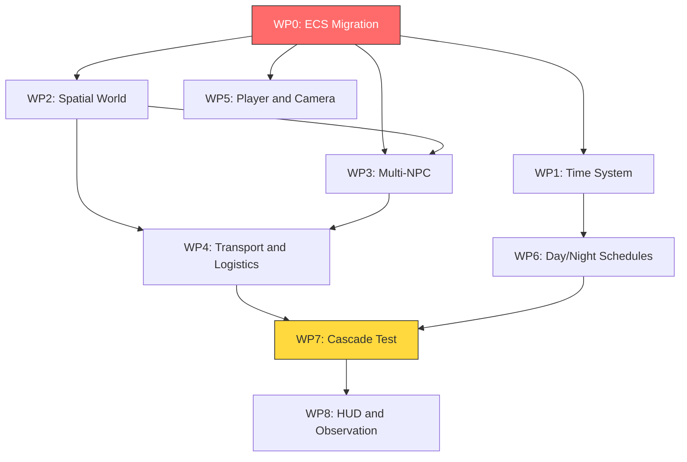

# Next Alpha Goal Plan — ReachingUniversalis

> **"Start with the Logistic Toy. Get 50 NPCs transporting food between two towns. Block the road. Watch what happens. Everything else follows from there."**
> — [AI-Idea.md](Docs/Currect%20Version/AI-Idea.md:607)

---

## 1. Alpha Milestone Definition

### What "Alpha" Means for ReachingUniversalis

Alpha is the **proof of life** — the moment the project stops being a tech demo and becomes a *world*. It is not feature-complete. It is not polished. It **is** the smallest coherent slice that demonstrates the five core pillars:

| Pillar | Alpha Validation |
|--------|-----------------|
| **Simulation-first** | The economy runs whether the player participates or not. NPCs produce, consume, and transport goods on their own. |
| **Indifferent world** | Nothing scales to the player. The player is one agent among dozens, subject to the same needs and constraints. |
| **NPC autonomy** | 30–50 NPCs independently satisfy needs, follow daily schedules, and react to changing conditions. |
| **Emergent narrative** | Disrupting a supply route causes cascading consequences — starvation, migration, desperation — that were not scripted. |
| **Causal accuracy** | Every resource can be traced: where it was produced, who carried it, who consumed it, and what happens when the chain breaks. |

### The Alpha Experience

The player loads into a world with **two settlements** connected by a **single road**. Settlement A has farms and produces food. Settlement B has a well and produces water. Both settlements need both resources. NPCs autonomously:

- Wake at dawn, work during the day, sleep at night
- Produce goods at their settlement's facilities
- Transport goods along the road to the other settlement
- Consume resources from their local stockpile
- Migrate or die when resources run out

The player controls **one character** — same needs, same rules — and can observe, work, carry goods, or simply watch the world function. The critical test: **block the road and watch cascading failure emerge unscripted.**

### What Alpha Is NOT

- Not a full economy — no currency, no haggling, no price signals yet
- Not a combat system — no violence, no health beyond needs
- Not a social sim — no relationships, memory, or factions
- Not a world generator — settlements and roads are hand-placed
- Not polished — placeholder graphics, minimal UI, no save/load

---

## 2. Current State Assessment

### What Exists Now (~5% of vision)

| Component | File | Status |
|-----------|------|--------|
| Game loop | [`main.cpp`](src/main.cpp:1) | ✅ 60 FPS, 1280×720 window |
| Game state | [`GameState.h`](src/GameState.h:1) | ✅ Minimal coordinator — holds World + HUD |
| World | [`World.h`](src/World.h:1) | ✅ 3 hardcoded infinite ResourceNodes + 1 NPC |
| NPC | [`NPC.h`](src/NPC.h:1), [`NPC.cpp`](src/NPC.cpp:1) | ✅ 3 needs, seek-satisfy loop, movement |
| Needs | [`Need.h`](src/Need.h:1) | ✅ Value/drain/threshold/refill data structure |
| Resource nodes | [`ResourceNode.h`](src/ResourceNode.h:1) | ✅ Type, position, radius, color — infinite, no depletion |
| HUD | [`HUD.h`](src/HUD.h:1), [`HUD.cpp`](src/HUD.cpp:1) | ✅ 3 need bars + state label for single NPC |
| Build system | [`CMakeLists.txt`](CMakeLists.txt:1) | ✅ C++17 + Raylib 5.5 via FetchContent |

### Critical Gaps Blocking Alpha

| Gap | Why It Blocks Alpha |
|-----|-------------------|
| **Architecture** — monolithic OOP | Cannot scale to 50 NPCs. [`World.h`](src/World.h:9) holds a single `NPC npc;` — no path to hundreds. |
| **No ECS** | Design doc mandates ECS. Current component-per-class pattern will collapse under inter-system queries. |
| **No time system** | No day/night, no variable tick rates. NPC schedules are impossible. |
| **No spatial structure** | No settlements, buildings, or roads. Just floating resource nodes on a flat plane. |
| **No scarcity** | [`ResourceNode`](src/ResourceNode.h:7) is infinite. No production, no depletion, no stockpiles. |
| **No inventory** | NPCs cannot carry anything. No items, no transport. |
| **No multi-NPC** | [`World`](src/World.h:9) has `NPC npc;` — singular. No population management. |
| **No player control** | Pure observation. No keyboard-driven agent. |
| **No camera** | Fixed viewport. Cannot pan/zoom to observe a multi-settlement world. |

---

## 3. Deliverables and Acceptance Criteria

### Work Package 0: ECS Architecture Migration

**Rationale**: The current OOP structure cannot scale. [`World.h`](src/World.h:9) holds a single `NPC npc;` and a `std::vector<ResourceNode> nodes;`. There is no way to add 50 NPCs, inventory, production facilities, or cross-cutting systems without either exploding class complexity or migrating to ECS. Do this first — everything else builds on it.

| ID | Deliverable | Acceptance Criteria |
|----|-------------|-------------------|
| 0.1 | EnTT integration | EnTT added to CMake via FetchContent. Compiles on Windows with MSVC. |
| 0.2 | Entity and component definitions | `Entity` = EnTT entity. Components defined: `Position`, `Velocity`, `Need`, `NeedType`, `Renderable`, `AgentState`. All are POD structs or simple data holders. |
| 0.3 | System interface | `System` base with virtual `Update(registry, dt)`. At minimum: `NeedDrainSystem`, `AgentDecisionSystem`, `MovementSystem`, `RenderSystem`. |
| 0.4 | Migrate existing NPC behavior | Current 1-NPC seek-satisfy loop reproduced via ECS systems + components. Behavior identical to current [`NPC::Update`](src/NPC.cpp:17). |
| 0.5 | Migrate existing resource rendering | Resource nodes rendered as entities with `Position`, `ResourceType`, `Renderable`. Visual output identical to current [`World::Draw`](src/World.cpp:18). |
| 0.6 | Migrate HUD | HUD queries registry for a tagged player/watched entity. Displays same need bars as current [`HUD::Draw`](src/HUD.cpp:9). |
| 0.7 | Remove old OOP classes | `NPC.h/cpp`, `ResourceNode.h/cpp` deleted. `World` becomes a registry wrapper. All behavior in systems. Build succeeds, behavior unchanged. |

**Validation**: After WP0, the application looks and behaves identically to the current build — 1 NPC, 3 resource nodes, HUD — but the architecture is ECS.

---

### Work Package 1: Time System

**Rationale**: Day/night and schedules are foundational. NPC behavior, production cycles, and the player's sense of a living world all depend on time passing visibly.

| ID | Deliverable | Acceptance Criteria |
|----|-------------|-------------------|
| 1.1 | Game clock | `TimeManager` tracks game time: tick count, hour-of-day, day-count. 1 real second = configurable game minutes. Default: 1 real second = 1 game minute → 1 game day = 24 real minutes. |
| 1.2 | Day/night visual cycle | Background color shifts: bright at noon, dark at midnight. NPCs and resources remain visible at night via ambient lighting. |
| 1.3 | Tick rate control | Player can press `+`/`-` to speed up or slow down game time. Pause with `Space`. HUD displays current time, day, and speed. |
| 1.4 | Time-aware need drain | `NeedDrainSystem` uses game-time delta, not frame delta. Needs drain at the same game-time rate regardless of tick speed. |

**Validation**: Watch the sky darken and lighten. Speed up time and see needs drain faster in real-time but at the same game-time rate. Pause freezes all simulation.

---

### Work Package 2: Spatial World Structure

**Rationale**: Settlements and roads are the stage on which the logistic toy plays out. Without spatial organization, there is no trade, no transport, and no supply chain to disrupt.

| ID | Deliverable | Acceptance Criteria |
|----|-------------|-------------------|
| 2.1 | Settlement entity | `Settlement` component: name, position, radius. Rendered as a labeled area on the map. Two settlements placed: "Greenfield" at x=300, "Wellsworth" at x=900. |
| 2.2 | Road entity | `Road` component: connects two settlements by position pairs. Rendered as a line between settlements. One road connects Greenfield ↔ Wellsworth. |
| 2.3 | World bounds | Map area expanded to ~2400×720 to fit two settlements with space between. Camera system from WP5 allows navigation. |
| 2.4 | Production facility entity | `ProductionFacility` component: type, settlement reference, production rate, output resource type. Greenfield has 2 Farms — each produces 1 Food unit per game-hour. Wellsworth has 2 Wells — each produces 1 Water unit per game-hour. |
| 2.5 | Settlement stockpile | `Stockpile` component per settlement: map of ResourceType → quantity. Facilities add to their settlement stockpile. Rendered as a small panel when settlement is selected. |
| 2.6 | Resource depletion | Remove infinite [`ResourceNode`](src/ResourceNode.h:7) concept. Resources exist as quantities in stockpiles, not as infinite nodes. Old resource node entities removed. |

**Validation**: Two settlements visible on map, connected by a road. Farms in Greenfield accumulate food in stockpile over game-time. Wells in Wellsworth accumulate water. Stockpile counts increment visibly.

---

### Work Package 3: Multi-NPC Population

**Rationale**: The core vision requires a population. One NPC is a proof-of-concept; 30–50 is a proof-of-world.

| ID | Deliverable | Acceptance Criteria |
|----|-------------|-------------------|
| 3.1 | NPC factory | `PopulationManager` spawns NPC entities with components: `Position`, `Velocity`, `Needs` array, `AgentState`, `HomeSettlement`, `Renderable`. Each NPC gets a numeric ID displayed on hover. |
| 3.2 | Initial population | 20 NPCs in Greenfield, 20 NPCs in Wellsworth. Total: 40. All have Hunger and Thirst needs. |
| 3.3 | NPC consumption | NPCs consume from their home settlement stockpile: 0.5 Food/hour, 0.8 Water/hour. Stockpile decrements. If stockpile is empty, need is not satisfied and continues draining. |
| 3.4 | NPC decision: local satisfaction | When a need drops below critical threshold, NPC moves to the production facility in its settlement that produces the needed resource. Stays there consuming until need is satisfied. |
| 3.5 | NPC decision: migration | If home settlement stockpile for a needed resource has been empty for 2+ game-hours, NPC begins migrating along the road to the other settlement. |
| 3.6 | NPC death | If any need reaches 0.0 and stays at 0.0 for 12 game-hours, NPC dies. Entity removed. Death logged to console with NPC ID and cause. |
| 3.7 | NPC rendering | NPCs rendered as colored circles. Color shifts: white = satisfied, yellow = need below threshold, red = critical. |

**Validation**: 40 NPCs move between facilities and stockpiles. When a stockpile runs low, NPCs visibly migrate. If a stockpile is empty long enough, NPCs die.

---

### Work Package 4: Transport and Logistics

**Rationale**: This is the heart of the Logistic Toy. Goods must physically move between settlements for the cascade test to work.

| ID | Deliverable | Acceptance Criteria |
|----|-------------|-------------------|
| 4.1 | Inventory component | `Inventory` component on NPC entities: map of ResourceType → quantity. Max carry capacity: 5 units total. |
| 4.2 | Hauler role | Some NPCs — 4 per settlement, 8 total — are assigned `Hauler` component. Haulers have a daily schedule: check home stockpile surplus → pick up goods → walk along road to other settlement → deposit in other stockpile → return. |
| 4.3 | Pickup interaction | Hauler at home stockpile with surplus > 10 units: picks up min of 5 units or surplus - 5. Stockpile decrements, hauler inventory increments. |
| 4.4 | Deposit interaction | Hauler arrives at destination settlement: deposits all carried units into destination stockpile. Inventory clears, stockpile increments. |
| 4.5 | Pathfinding: road following | Haulers move along the road path between settlements, not in a straight line. Simple waypoint following along road segments. |
| 4.6 | Transport visualization | Haulers rendered slightly larger or with a cargo indicator. When carrying, a small colored dot appears next to them indicating cargo type. |

**Validation**: Haulers visibly walk between settlements carrying goods. Greenfield's water stockpile fills from Wellsworth imports. Wellsworth's food stockpile fills from Greenfield imports. The supply chain is observable.

---

### Work Package 5: Player Character and Camera

**Rationale**: The player must be embodied in the world — same rules, same constraints — and must be able to observe the full map.

| ID | Deliverable | Acceptance Criteria |
|----|-------------|-------------------|
| 5.1 | Player entity | Player is an NPC entity with `PlayerControlled` tag. Same `Needs`, same `Inventory`, same `HomeSettlement`. Spawns in Greenfield. |
| 5.2 | Keyboard movement | WASD moves player entity. Speed matches NPC move speed. Movement is game-time aware — paused = no movement. |
| 5.3 | Camera follow + pan/zoom | Camera follows player by default. Arrow keys or middle-mouse-drag pans camera. Scroll wheel zooms. Press `C` to re-center on player. |
| 5.4 | Player interaction | When player is within range of a stockpile, press `E` to deposit or `Q` to pick up 1 unit of the most-needed resource. |
| 5.5 | Player needs | Player's needs drain identically to NPCs. If needs reach 0 for 12 game-hours, player dies. Display "You have perished." message. Press `R` to respawn as a new character in a random settlement. |
| 5.6 | Player HUD | HUD shows player's needs, inventory, current time, and settlement stockpile info when near a settlement. |

**Validation**: Player can walk between settlements, carry goods, and die from neglect. Camera allows observing the full world. Player is not special — same rules apply.

---

### Work Package 6: Day/Night Schedules

**Rationale**: Schedules make NPC behavior legible. A farmer who wakes at dawn, works the fields, and sleeps at night is believable. One that optimizes 24/7 is alien.

| ID | Deliverable | Acceptance Criteria |
|----|-------------|-------------------|
| 6.1 | Schedule component | `Schedule` component: wake hour, work start, work end, sleep hour. Default: wake=6, work=7-17, sleep=22. |
| 6.2 | Sleep need | Add `Energy` need to all NPCs. Drains during wake hours, refills during sleep. NPCs move to their settlement center and stop moving during sleep hours. |
| 6.3 | Work behavior | During work hours, non-hauler NPCs move to their settlement's production facility and increase its production rate by being present — facility produces 50% faster per worker present, up to 2x base rate. |
| 6.4 | Night behavior | NPCs not working or sleeping idle near settlement center. No production at night. Haulers do not travel at night — they sleep. |
| 6.5 | Visual sleep indicator | Sleeping NPCs rendered with a small "z" indicator or dimmed color. |

**Validation**: NPCs visibly sleep at night and work during the day. Production is higher during work hours. Haulers only travel during the day. The world has a rhythm.

---

### Work Package 7: The Cascade Test — Disruption and Emergence

**Rationale**: This is the Alpha validation. If disrupting the supply chain produces unscripted cascading consequences, the core design works. If not, the systems need more coupling.

| ID | Deliverable | Acceptance Criteria |
|----|-------------|-------------------|
| 7.1 | Road blockage mechanic | Press `B` to toggle a blockade on the road. Blockade rendered as a red X on the road. Haulers cannot path through a blockade. |
| 7.2 | Cascade: stockpile depletion | When road is blocked, Greenfield's water stockpile depletes — no more imports from Wellsworth. Wellsworth's food stockpile depletes — no more imports from Greenfield. |
| 7.3 | Cascade: NPC migration | NPCs in the deprived settlement begin migrating along the road. If road is blocked, they cannot cross. They cluster at the blockade. |
| 7.4 | Cascade: NPC death | NPCs whose needs reach 0 for 12 game-hours die. Death count visible in HUD. |
| 7.5 | Cascade: production collapse | Dead NPCs don't work. Production facilities slow down as workers die. Fewer workers → less production → more scarcity. Positive feedback loop. |
| 7.6 | Unblock and recovery | Remove blockade. Surviving haulers resume transport. Stockpiles slowly recover. Migration stabilizes. |
| 7.7 | Event log | Console/log panel shows key events: "Hauler #12 deposited 5 Food at Wellsworth", "NPC #7 died of thirst at Wellsworth", "Road blocked", "Road unblocked". |

**Validation**: Block the road. Within 10–20 game-hours, the deprived settlement shows visible starvation. NPCs die. Production drops. Unblock the road and watch slow recovery. **This is the Alpha proof.**

---

### Work Package 8: HUD and Observation Tools

**Rationale**: The player needs to understand what is happening and why. Without observability, deep simulation feels like randomness.

| ID | Deliverable | Acceptance Criteria |
|----|-------------|-------------------|
| 8.1 | Settlement info panel | Click on a settlement to see: name, population count, stockpile quantities, production rates, recent events. |
| 8.2 | NPC info on hover | Hover over an NPC to see: ID, current state, need levels, home settlement, inventory contents. |
| 8.3 | World status bar | Top of screen: game time, day count, total population, tick speed, road status — open or blocked. |
| 8.4 | Event log panel | Bottom of screen: scrollable log of recent events — deaths, deposits, migrations, blockades. Last 50 events visible. |
| 8.5 | Debug overlay toggle | Press `F1` to toggle debug overlay showing: all NPC positions, stockpile quantities at each settlement, production facility status. |

**Validation**: Player can click a settlement and see its stockpiles. Hover an NPC and see its state. Read the event log to understand what happened while they weren't looking.

---

## 4. Dependency Graph and Critical Path



### Critical Path

**WP0 → WP2 → WP3 → WP4 → WP7**

ECS migration must complete first. Then spatial structure and multi-NPC can proceed in parallel with time system. Transport depends on both settlements and NPCs existing. The cascade test depends on transport working. Everything else is off-critical-path.

### Suggested Execution Order

| Phase | Work Packages | Rationale |
|-------|-------------|-----------|
| **Phase A** | WP0 | Foundation — nothing else works without ECS |
| **Phase B** | WP1, WP2 | Time + Space — can be developed in parallel after WP0 |
| **Phase C** | WP3 | Population — needs settlements from WP2 |
| **Phase D** | WP4, WP5, WP6 | Transport, Player, Schedules — can be developed in parallel after WP3 |
| **Phase E** | WP7 | Cascade Test — needs transport + schedules |
| **Phase F** | WP8 | HUD — polish after core loop works |

---

## 5. Architecture Decisions

### 5.1 ECS Framework: EnTT

**Decision**: Use [EnTT](https://github.com/skypjack/EnTT) as the ECS library.

**Rationale**:
- Header-only, C++17, zero dependencies — integrates via FetchContent like Raylib
- Industry-proven: used by Minecraft, Rust, and many indie simulations
- View-based system iteration is cache-friendly for thousands of entities
- Signals/delegate system useful for event propagation later

**Integration**:
```cmake
# Add to CMakeLists.txt alongside Raylib
FetchContent_Declare(
    entt
    GIT_REPOSITORY https://github.com/skypjack/EnTT.git
    GIT_TAG v3.13.2
)
FetchContent_MakeAvailable(entt)
target_link_libraries(ReachingUniversalis PRIVATE EnTT::EnTT)
```

### 5.2 Component Design Principles

- **Components are data only** — no logic, no methods, no inheritance
- **Systems are functions or function-objects** — they operate on views of components
- **No system depends on another system's implementation** — only on component data
- **World state lives in the registry** — no hidden singletons or global state

### 5.3 Proposed Component Catalog for Alpha

| Component | Fields | Used By |
|-----------|--------|---------|
| `Position` | `float x, y` | Movement, Render, Decision |
| `Velocity` | `float x, y` | Movement |
| `Need` | `NeedType type; float value, drainRate, criticalThreshold, refillRate` | NeedDrain, Decision |
| `AgentState` | `enum state` — Idle, Working, Seeking, Satisfying, Sleeping, Migrating, Dead | Decision, Render |
| `HomeSettlement` | `entity settlement` | Decision, Consumption |
| `Schedule` | `int wakeHour, workStart, workEnd, sleepHour` | ScheduleSystem |
| `Inventory` | `map<ResourceType, int> contents; int maxCapacity` | Transport, Player |
| `Hauler` | `entity targetSettlement; bool carrying` | Transport |
| `ProductionFacility` | `ResourceType output; float baseRate; int workersPresent` | Production |
| `Settlement` | `string name; float radius` | Render, Info |
| `Stockpile` | `map<ResourceType, float> quantities` | Consumption, Transport, Info |
| `Road` | `entity from, to; bool blocked` | Transport, Render |
| `Renderable` | `Color color; float size; RenderShape shape` | Render |
| `PlayerControlled` | tag — no data | Input |
| `TimeManager` | singleton — `float gameSeconds; int tickSpeed` | Time |

### 5.4 System Catalog for Alpha

| System | Query | Behavior |
|--------|-------|----------|
| `TimeSystem` | TimeManager singleton | Advance game time, handle tick rate changes |
| `NeedDrainSystem` | `Need` | Drain need values based on game-time delta |
| `ScheduleSystem` | `Schedule, AgentState, TimeManager` | Set AgentState to Sleeping/Working based on time |
| `ProductionSystem` | `ProductionFacility, Stockpile, TimeManager` | Add resources to stockpile based on rate × workers × dt |
| `ConsumptionSystem` | `HomeSettlement, Need, Stockpile` | NPCs consume from home stockpile; if empty, need continues draining |
| `DecisionSystem` | `Need, AgentState, Position, HomeSettlement, Inventory` | Choose action: seek local, migrate, work, sleep |
| `MovementSystem` | `Position, Velocity` | Apply velocity to position |
| `TransportSystem` | `Hauler, Inventory, Position, Stockpile, Road` | Hauler pickup/deposit/road-following logic |
| `DeathSystem` | `Need, AgentState` | Kill NPCs with needs at 0 for too long |
| `PlayerInputSystem` | `PlayerControlled, Position, Velocity, Inventory` | WASD movement, E/Q interaction |
| `CameraSystem` | `PlayerControlled, Position` | Follow player, handle pan/zoom |
| `RenderSystem` | `Position, Renderable` | Draw all entities |
| `HUDSystem` | `PlayerControlled, Need, TimeManager, Settlement, Stockpile` | Draw HUD overlays |

### 5.5 Migration Strategy

**Do not incrementally refactor.** The current codebase is small — 7 source files, ~300 lines total. A clean rewrite on the ECS architecture is faster and less error-prone than trying to gradually extract components from monolithic classes.

1. Add EnTT to the build
2. Create new `ECS/` directory with component and system headers
3. Rewrite `GameState` to own a registry and a system scheduler
4. Reproduce current behavior in ECS — verify visual parity
5. Delete old `NPC.h/cpp`, `ResourceNode.h/cpp`
6. Update `World` to be a thin wrapper around the registry

### 5.6 Directory Structure After Migration

```
src/
  main.cpp
  GameState.h / .cpp          — owns registry + system scheduler
  ECS/
    Components.h               — all component structs
    Components.cpp             — any component helper functions
    Systems/
      TimeSystem.h / .cpp
      NeedDrainSystem.h / .cpp
      ScheduleSystem.h / .cpp
      ProductionSystem.h / .cpp
      ConsumptionSystem.h / .cpp
      DecisionSystem.h / .cpp
      MovementSystem.h / .cpp
      TransportSystem.h / .cpp
      DeathSystem.h / .cpp
      PlayerInputSystem.h / .cpp
      CameraSystem.h / .cpp
      RenderSystem.h / .cpp
      HUDSystem.h / .cpp
  World/
    WorldGenerator.h / .cpp    — creates initial entities for Alpha scenario
  UI/
    HUD.h / .cpp               — rendering-only, queries registry
    EventLog.h / .cpp          — event log display
```

---

## 6. Definition of Done — Alpha

### Functional Criteria

- [ ] **F1**: Two settlements exist on the map, connected by one visible road
- [ ] **F2**: 40 NPCs live across both settlements with Hunger, Thirst, and Energy needs
- [ ] **F3**: Production facilities generate resources into settlement stockpiles over game-time
- [ ] **F4**: NPCs consume resources from their home stockpile to satisfy needs
- [ ] **F5**: Haulers transport goods between settlements along the road
- [ ] **F6**: NPCs follow day/night schedules — work during day, sleep at night
- [ ] **F7**: Player character exists with same needs and rules as NPCs
- [ ] **F8**: Player can move with WASD, interact with stockpiles, and observe the world
- [ ] **F9**: Camera supports pan, zoom, and follow-player
- [ ] **F10**: Day/night cycle is visually apparent

### The Cascade Test

- [ ] **C1**: Blocking the road causes stockpile depletion in the dependent settlement
- [ ] **C2**: NPCs in the deprived settlement begin migrating when stockpiles are empty
- [ ] **C3**: NPCs die when needs remain at 0 for 12 game-hours
- [ ] **C4**: Deaths reduce production capacity, creating positive feedback — fewer workers → less production → more scarcity
- [ ] **C5**: Unblocking the road allows recovery — haulers resume, stockpiles refill, migration stabilizes
- [ ] **C6**: All of the above happens **without any scripting** — it emerges from system interactions

### Technical Criteria

- [ ] **T1**: ECS architecture in place — EnTT registry, component structs, system classes
- [ ] **T2**: No monolithic NPC or ResourceNode classes remain — all behavior in systems
- [ ] **T3**: Game runs at 60 FPS with 40 NPCs + haulers + facilities active
- [ ] **T4**: Time system supports pause, normal speed, and 2x/4x acceleration
- [ ] **T5**: Event log records key world events — deaths, deposits, blockades
- [ ] **T6**: HUD displays player needs, settlement info, world time, population count

### Design Principle Validation

- [ ] **P1**: *Simulation-first* — The economy runs for 10 game-days with zero player input and remains stable
- [ ] **P2**: *Indifferent world* — The player can die and the world continues without them
- [ ] **P3**: *NPC autonomy* — NPCs independently decide to work, eat, sleep, and migrate based on their needs and local conditions
- [ ] **P4**: *Emergent narrative* — The cascade test produces different outcomes each run based on timing and NPC distribution
- [ ] **P5**: *Causal accuracy* — Every resource in a stockpile can be traced to a production event; every consumption can be traced to an NPC

---

## 7. Out of Scope for Alpha

These are explicitly deferred to post-Alpha work:

| Deferred Feature | Reason | Target Phase |
|-----------------|--------|-------------|
| Currency / prices / markets | Needs inventory and transport first | Phase 1 |
| NPC relationships / memory | Needs stable population first | Phase 3 |
| Combat system | Needs health model first | Phase 2 |
| Detailed health / injuries | Needs basic needs stability first | Phase 2 |
| Skills system | Needs production chains first | Phase 1 |
| Crafting / construction | Needs item system first | Phase 2 |
| Procedural world generation | Alpha uses hand-placed settlements | Phase 4 |
| Save / load | Important but not core validation | Phase 1 |
| Weather / temperature | Adds complexity without proving core loop | Phase 1 |
| Multiple regions | Alpha is one region | Phase 4 |
| LOD simulation | Only 40 NPCs — not needed yet | Phase 4 |
| Sound / audio | Polish, not validation | Phase 5 |
| Mod support / data-driven design | Needs stable architecture first | Phase 1 |

---

## 8. Risk Assessment

| Risk | Likelihood | Impact | Mitigation |
|------|-----------|--------|-----------|
| ECS migration breaks existing behavior | Medium | High | Reproduce current behavior exactly before adding features. Visual parity test. |
| 40 NPCs too slow at 60 FPS | Low | High | Profile early. EnTT views are cache-friendly. If slow, batch updates and reduce per-NPC work. |
| Cascade test produces degenerate behavior | Medium | High | Add event logging from day one. Tune need drain rates and migration thresholds iteratively. |
| Scope creep — adding features not in this plan | High | Medium | Refer to Section 7. Every new feature must pass: "Does this prove the Alpha validation criteria?" |
| Hauler pathfinding too complex | Low | Medium | Use simple waypoint following along road segments. No A* needed for one road. |
| Day/night schedules make NPCs look robotic | Medium | Low | Add small random offsets to wake/work/sleep times per NPC. Not a priority — fix post-Alpha. |
| Player death feels punishing | Medium | Low | Respawn mechanic included. This is by design — indifferent world philosophy. |

---

## 9. Success Metric

> **Alpha succeeds when a new player can block the road between two settlements, watch NPCs starve, migrate, and die, unblock the road, and watch the world slowly recover — and understand that none of it was scripted.**

Everything else is scaffolding.
